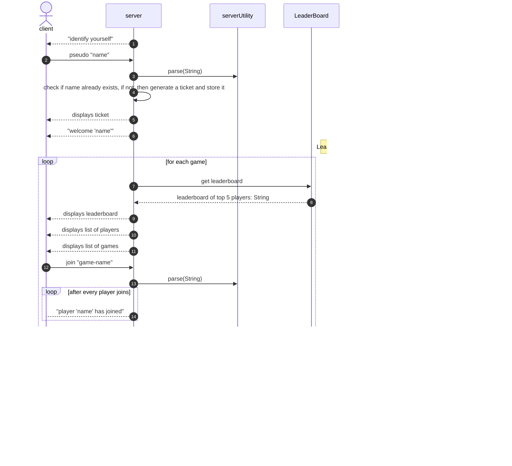

```mermaid
sequenceDiagram
autonumber

actor client
participant server
participant serverUtility
participant LeaderBoard

server-->>client: "identify yourself"
client->>server: pseudo "name"

server->>serverUtility: parse(String) 

server->>server: check if name already exists, if not, then generate a ticket and store it
server-->>client: displays ticket
server-->>client: "welcome 'name'"

Note right of LeaderBoard: LeaderBoard is a static class and will store a TreeMap of all players

loop for each game
server->>LeaderBoard: get leaderboard
LeaderBoard-->>server: leaderboard of top 5 players: String
server-->>client: displays leaderboard

server-->>client: displays list of players
server-->>client: displays list of games

client->>server: join "game-name"

server->>serverUtility: parse(String) 

loop after every player joins
server-->client: "player 'name' has joined"
end

client->>server: ready

loop at every round
server-->>client: "enter a number:"
client->>server: guess "number"
server-->>client: "game round n ..."
end

server-->>client: end game
end


```

