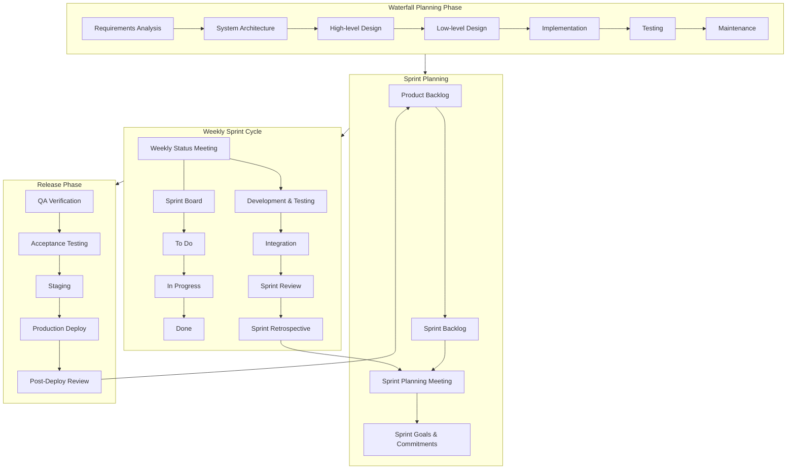

```mermaid
flowchart TD
    subgraph Waterfall[Waterfall Planning Phase]
        A[Requirements Analysis] --> B[System Architecture]
        B --> C[High-level Design]
        C --> D[Low-level Design]
        D --> E[Implementation]
        E --> F1[Testing]
        F1 --> G1[Maintenance]
    end

    subgraph Sprint_Planning[Sprint Planning]
        F[Product Backlog] --> G[Sprint Backlog]
        G --> H[Sprint Planning Meeting]
        H --> I[Sprint Goals & Commitments]
    end

    subgraph Sprint_Execution[Weekly Sprint Cycle]
        J[Weekly Status Meeting] --> K[Development & Testing]
        K --> L[Integration]
        L --> M[Sprint Review]
        M --> N[Sprint Retrospective]
        
        J --- O[Sprint Board]
        O --> P[To Do]
        P --> Q[In Progress]
        Q --> R[Done]
    end

    subgraph Release[Release Phase]
        S[QA Verification] --> T[Acceptance Testing]
        T --> U[Staging]
        U --> V[Production Deploy]
        V --> W[Post-Deploy Review]
    end

    Waterfall --> Sprint_Planning
    Sprint_Planning --> Sprint_Execution
    Sprint_Execution --> Release
    W --> F
    N --> H
```