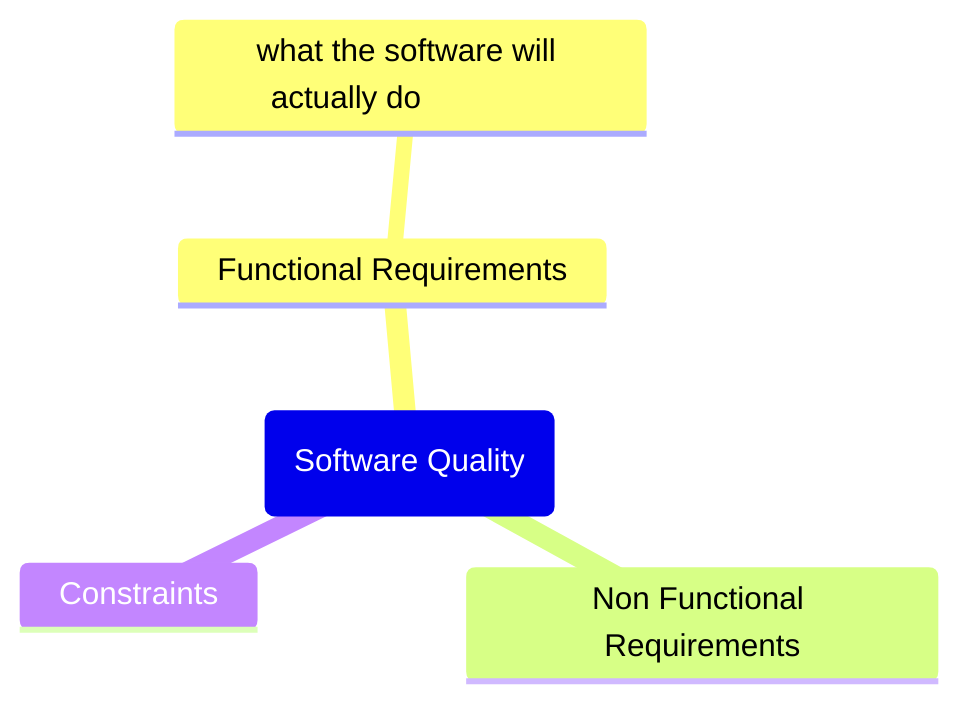

# Motivation
- Software quality is the degree to which software possesses a desired combination of attributes (e.g., reliability, interoperability) (IEEE 1061).
- The ultimate goal is the ability to quantitatively evaluate and trade off multiple quality attributes to arrive at a better overall system.

- functional requirements, 
- non functional requirements
	- quality characteristics
- constraints
	- limits by system (internal/external)
		- technology: use certain technology only, not anything else
		- delivery schedule: deadline to submit
		- effort: budget is limited/can recruit only certain number of staff
	- cannot negotiate them, so how to deal with them?
		- 

ISO 9126