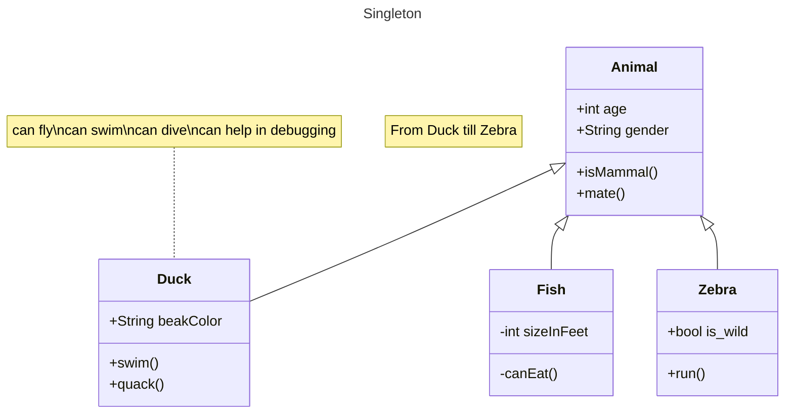

- Will do following design patterns:
	1) as;djfk
# Factory Method Design Pattern:
- It is a creation design pattern
- By applying this, we can create objects without exposing creation logic to the client

# Singleton:
- creational design pattern


```java
Public class Singleton {

	private static 

}
```
# Proxy:
- Structural design pattern
- dont let the client directly access an object, make the client use the object through a proxy
- The proxy will instantiate the realSubject object then the realSubject will do the actual operations, the methods of realSubject will be called inside the proxy

# Adapter:
- adapter will provide a bridge class between a class that uses the bridge class's interface, but want to perform the operations of the adaptee.
# Façade:
- Provide an interface to multiple classes

>[!note] Adapter and Façade
>Adapter and Façade are similar to what we call wrapper classes (i.e. they provide interfaces)

>[!info] Difference Between Adapter and Façade
>- Adapter uses the old interface, while Façade provides a new interface
>- Adapter adapts one element, Façade adapts multiple elements